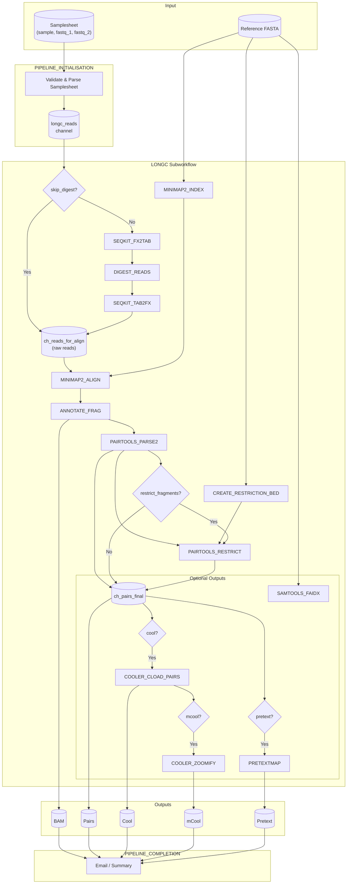

# tollongc Pipeline Flowchart



## Simplified Linear View

```
┌─────────────────────────────────────────────────────────────────────────────┐
│                           tollongc Pipeline                                  │
└─────────────────────────────────────────────────────────────────────────────┘

  Input                    Digest (if !skip_digest)           Alignment
  ─────                    ────────────────────────            ─────────
  Samplesheet     ──►      SEQKIT_FX2TAB                     MINIMAP2_INDEX
  Reference       ──►      DIGEST_READS              ──►     MINIMAP2_ALIGN
                           SEQKIT_TAB2FX                     ANNOTATE_FRAG

  Pairs Processing         Restrict (optional)                Optional Outputs
  ─────────────────       ──────────────────                 ────────────────
  PAIRTOOLS_PARSE2  ──►    PAIRTOOLS_RESTRICT        ──►     COOLER_CLOAD_PAIRS
  (BAM → pairs)           (if restrict_fragments)            COOLER_ZOOMIFY
                                                             PRETEXTMAP

  Outputs: BAM | Pairs | Cool | mCool | Pretext
```

## Process Summary

| Step | Process | Input | Output |
|------|---------|-------|--------|
| 1 | SEQKIT_FX2TAB | FASTQ | Tabular (name, seq, qual) |
| 2 | DIGEST_READS | Tabular + cutter | Digested tabular |
| 3 | SEQKIT_TAB2FX | Digested tabular | FASTQ |
| 4 | MINIMAP2_INDEX | Reference FASTA | Index |
| 5 | MINIMAP2_ALIGN | Reads + Index | BAM |
| 6 | ANNOTATE_FRAG | BAM | Annotated BAM |
| 7 | PAIRTOOLS_PARSE2 | BAM + reference | Pairs |
| 8 | CREATE_RESTRICTION_BED | Reference + cutter | BED |
| 9 | PAIRTOOLS_RESTRICT | Pairs + BED | Restricted pairs |
| 10 | COOLER_CLOAD_PAIRS | Pairs + reference | Cool |
| 11 | COOLER_ZOOMIFY | Cool | mCool |
| 12 | PRETEXTMAP | Pairs | Pretext |
